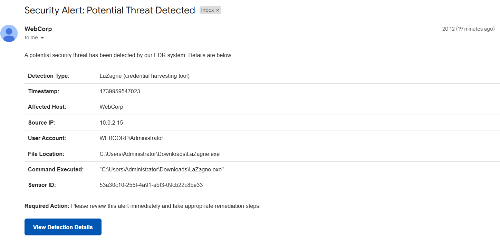
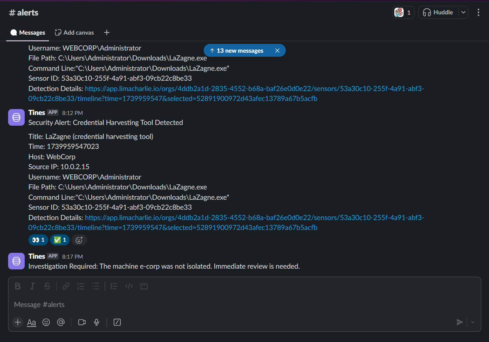
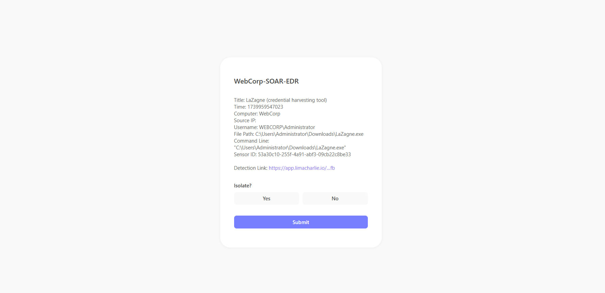

# Security Automated Threat Detection & Response
### *Intelligent Threat Detection & Automated Incident Response*

---

## 📖 Project Overview
This project implements a high-performance **SOAR (Security Orchestration, Automation, and Response)** workflow designed to bridge the gap between initial detection and final remediation. 

By integrating **LimaCharlie EDR** with **Tines Automation**, the system detects malicious activities (such as credential dumping or hack-tool execution) and orchestrates a seamless response path including real-time alerting and automated machine isolation with human-in-the-loop validation.

## Features

**Automated Threat Detection** – Detects hack tools and malicious activities using **LimaCharlie**  
**Real-time Alerting** – Sends alerts with detailed information via **Slack and SMTP**  
**User Decision Workflow** – Prompts for manual confirmation before isolating a machine  
**Automated Machine Isolation** – Uses **LimaCharlie** to isolate infected systems  
**Incident Tracking** – Notifies teams via **Slack** if a machine is isolated or if further investigation is needed  

## **Workflow Overview**
1. **Threat Detection**
   - The system detects a compromised endpoint using **LimaCharlie**
   - A threat detection alert is generated and sent to **Tines**

2. **Alerting & Notification**
   - Tines processes the detection alert and sends real-time notifications via **Slack** and **SMTP**.

3. **User Decision Prompt**
   - The user is prompted via a web UI (powered by Tines) to decide whether to isolate the compromised machine.
   - The user chooses between:
     - **Yes** → The machine is isolated using **LimaCharlie**
     - **No** → An investigation alert is sent to **Slack** for further review.

4. **Automated Machine Isolation (If Confirmed)**
   - If the user confirms isolation, LimaCharlie isolates the machine.
   - A confirmation message is sent via **Slack**.

5. **Manual Investigation Required (If Not Confirmed)**
   - If the user declines isolation, a notification is sent to **Slack** indicating further investigation is required.

## **Alert Examples**

### **SMTP Alert**
An SMTP notification is sent to security teams, providing details about the detected threat, including:
- Detection Type
- Timestamp
- Affected Host
- Source IP
- User Account
- File Location
- Command Executed
- Sensor ID

Figure 1: E-mail

 
### **Slack Alert**
A Slack message is sent in real-time to notify the security team of a detected threat.

Figure 2: Slack

### **User Decision Page**
Security analysts can decide whether to isolate the machine through an interactive UI.

Figure 3: User Decision Page

## Technology Stack
*   **LimaCharlie:** Endpoint Detection and Response (EDR) & Artifact Collection.
*   **Tines:** No-code automation platform for logic orchestration.
*   **Slack:** Real-time communication and interactive response hub.
*   **SendGrid/SMTP:** Formal incident reporting and audit trails.
